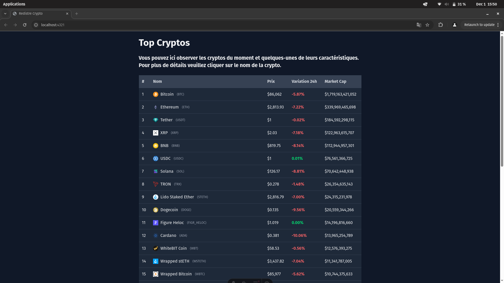

# TypeScript Project – Demo Website & Cryptocurrency API

This repository contains two separate applications written in **TypeScript**:

1. **A demo website** showcasing various practical exercises.
2. **A cryptocurrency API**, allowing to query real-time and historical crypto data.

## Features

### Demo Website (website)


- Showcases multiple practical exercises (DOM, API calls, components, etc.)
- Simple and responsive UI

### Cryptocurrency API (crypto-market)
<table>
  <tr>
    <td align="center">
      <p>Crypto trends</p>
      
    </td>
    <td align="center">
      <p>Details on crypto</p>
      
    </td>
  </tr>
</table>


- Endpoints include:
  - Current prices
  - Price history (24h)
  - Data by cryptocurrency
  - Top performing cryptos list

## Installation

### 1. Clone the repository

```bash
git clone https://github.com/carlmonnaert/Typescript-Display.git
cd Typescript-display
```

### 2. Install global dependencies
```bash
bun install
```
## Getting started

### Start the demo website

```bash
cd website
bun run dev
```

### Start the cryptocurrency API
```bash
cd crypto-market
bun run dev
```
## Useful Scripts
### Demo website (website)

- bun run dev — start development server

- bun run build — build for production

- bun run preview — preview production build


## License
This project is licensed under the MIT License.
Feel free to use, modify, and share it.
